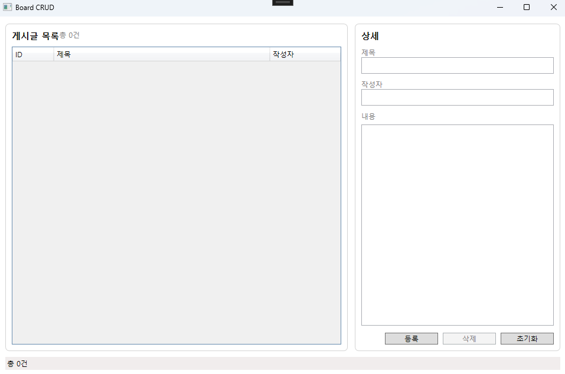
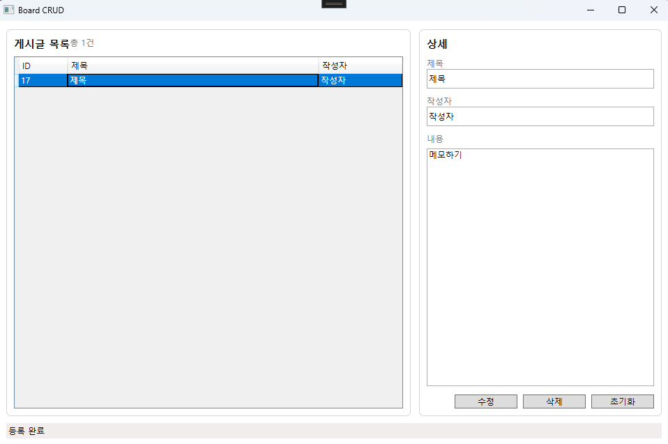

# BoardApp


- WPF(.NET 8) 기반의 간단한 CRUD 게시판 애플리케이션
- EF Core + SQLite를 사용하여 로컬 DB에 데이터 저장하고 Repository / Service 계층을 분리하여 유지보수 용이.


## 실행 화면

### 초기 화면



### 게시글 등록 및 조회




# 1. 프로젝트 목적

- WPF MVVM 구조 이해
- EF Core Code First 사용 경험
- Repository / Service 분리 설계 연습
- 기본 CRUD 패턴 구현


# 2. 기술 스택

- .NET 8
- WPF
- MVVM
- EF Core
- SQLite

## 사용한 NuGet 패키지

- CommunityToolkit.Mvvm
	- WPF MVVM 패턴 구현을 위한 라이브러리
- Microsoft.EntityFrameworkCore
	- .NET 환경에서 데이터베이스와 객체 간 매핑을 위한 ORM 프레임워크
- Microsoft.EntityFrameworkCore.Sqlite
	- SQLite 데이터베이스를 사용하기 위한 EF Core Provider
- Microsoft.EntityFrameworkCore.Design
	- 마이그레이션 생성 등 설계 기능 지원
- Microsoft.EntityFrameworkCore.Tools
	- Package Manager Console 및 CLI에서 마이그레이션 명령어를 사용하기 위한 도구


# 3. 주요 기능

- 게시글 등록/조회/수정/삭제
- 선택 상태 기반 UI 전환 (등록 / 수정 모드)
- SQLite 로컬 DB 저장


# 4. 프로젝트 구조

```
BoardApp
 ├─ Data
 │   ├─ AppDbContext.cs
 │   └─ AppDbContextFactory.cs
 │
 ├─ Models
 │   └─ Post.cs
 │
 ├─ Repositories
 │   ├─ IPostRepository.cs
 │   └─ PostRepository.cs
 │
 ├─ Services
 │   ├─ IPostService.cs
 │   └─ PostService.cs
 │
 ├─ ViewModels
 │   └─ MainViewModel.cs
 │
 ├─ Views
 │   └─ MainWindow.xaml
 │        └─ MainWindow.xaml.cs
 │
 └─ App.xaml
	  └─ App.xaml.cs
```


# 5. 계층 설계 의도

## Model

- DB 테이블 구조 정의
- Post 엔티티


## Data (DbContext)

- SQLite 연결
- EF Core 설정
- Migration 대상


## Repository

역할

- DB 접근 책임 분리
	- DB 교체 시 영향 최소화
- CRUD 직접 수행


## Service

역할

- 비즈니스 로직 처리
	- UI와 DB 사이 결합도 감소하여 유지보수 용이
- 입력값 검증


## ViewModel

역할

- UI 상태 관리
- Command 처리
- MVVM 패턴 핵심


## View (WPF)

- 목록 + 상세 입력 폼 구조
- 선택 상태 기반 등록/수정 모드 전환


# 6. 실행 방법

## 1) 패키지 복원

```
dotnet restore
```

또는 Visual Studio에서 빌드


## 2) 최초 실행 전 마이그레이션 생성

프로젝트 루트에서 실행

```
dotnet ef migrations add InitialCreate
```


## 3) DB 생성 및 적용

```
dotnet ef database update
```

실행 후 `board.db` 파일이 생성됩니다.


# 7. 실행

Visual Studio

```
F5 실행
```

또는

```
dotnet run
```


# 8. 동작 흐름

1. 앱 시작 시 DB 마이그레이션 자동 적용
2. 게시글 목록 로드
3. 선택 시 상세 영역에 데이터 바인딩
4. 등록/수정/삭제 수행 후 목록 갱신
